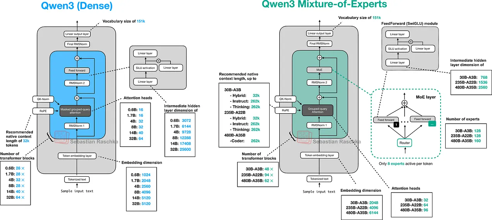

# Qwen Refactor Notes

This folder documents my refactor of the Qwen-style model into smaller modules and explains what I found while tracing the architecture from the prompt to the sampled token.

## What I found

The biggest design choice is that the model is not treated as one large forward pass anymore. It is split into clear layers:

- `config.py` defines the shape contract and layer routing.
- `model.py` orchestrates embedding, masking, decoding, normalization, and the output head.
- `decoder.py` selects the right block type for each layer.
- `attention.py` handles the full self-attention path.
- `gated_delta.py` handles the recurrent linear-attention-style path.
- `cache.py` keeps the state needed for incremental decoding.
- `generation.py` turns logits into actual token sampling.

That separation makes the architecture easier to reason about. Instead of mixing control flow, state management, and math in one file, each module owns one concern.

## Main findings

### 1. RoPE is the positional core
The original implementation uses rotary position embedding to inject relative position information into query and key vectors. The important idea is that position becomes a rotation, not an added vector, so the attention score still reflects relative distance.

The reference implementation also uses an interleaved MRoPE path, which means the rotary channels are split into sections before they are applied. That matches the Qwen3-style multi-stream rotary setup more closely than a simple single-block RoPE.

### 2. Caching is part of the architecture, not an afterthought
The cache is doing more than storing keys and values. It also carries the recurrent and convolutional state for the delta path, so incremental generation can reuse the right state on the next token step.

### 3. The decoder is a routing layer
The decoder does not assume every block behaves the same way. It reads the layer schedule from config and routes each layer to either full attention or the gated delta block. That makes the stack more flexible and easier to experiment with.

### 4. Generation is separate from the model
The refactor keeps sampling policy outside the network itself. Temperature, top-k, and top-p belong to `generation.py`, while the model only produces logits. That is a cleaner boundary for inference work.

## Architecture overview

The picture in [architecture.webp](./architecture.webp) matches the refactor story: input ids go through embeddings, then the decoder stack, then final normalization and the language-model head, and finally the sampler turns logits into the next token.



## Run the demo

```bash
python -m qwen_refactor.main
```

## Source map

- [docs/overview.md](docs/overview.md)
- [docs/config.md](docs/config.md)
- [docs/model.md](docs/model.md)
- [docs/decoder.md](docs/decoder.md)
- [docs/attention.md](docs/attention.md)
- [docs/gated_delta.md](docs/gated_delta.md)
- [docs/cache.md](docs/cache.md)
- [docs/generation.md](docs/generation.md)
- [docs/mlp.md](docs/mlp.md)
- [docs/core.md](docs/core.md)
- [docs/main.md](docs/main.md)

## References
 Ahead of AI, Sebastian Raschka: Understanding and Implementing Qwen3 From Scratch (https://magazine.sebastianraschka.com/p/qwen3-from-scratch)

EleutherAI Blog: Rotary Embeddings: A Relative Revolution (https://blog.eleuther.ai/rotary-embeddings/)

YouTube Tutorial Coded Harsh: Coding Qwen 3.5 LLM from scratch!(https://www.youtube.com/watch?v=wzW7Kf7sDvU)

