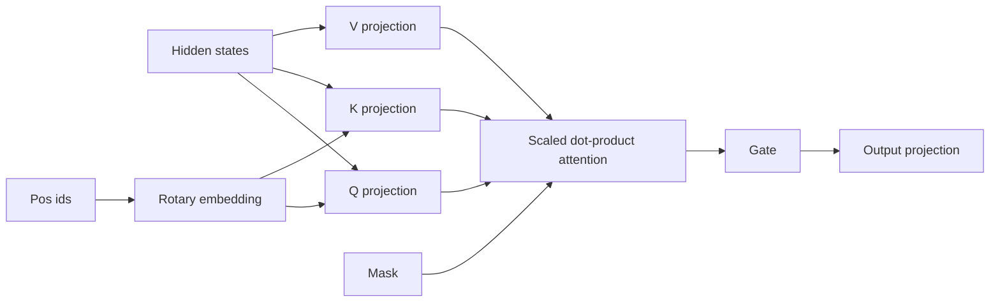

# `attention.py`

`attention.py` implements the full self-attention backend as an isolated module.
This is the standard transformer path in the refactor, but it is written to fit the same cache and config system as the rest of the model.

## Pipeline
1. Project hidden states into queries, keys, values, and gates.
2. Normalize the query and key heads with RMSNorm.
3. Build rotary embeddings from the position ids.
4. Apply RoPE to queries and keys.
5. Expand cached keys and values if a prefix exists.
6. Compute scaled dot-product attention.
7. Apply masking.
8. Combine values and project back to hidden size.

## Math
Given queries $Q$, keys $K$, and values $V$:

$$
A = \operatorname{softmax}\left(\frac{QK^\top}{\sqrt{d_h}} + M\right)
$$

where $M$ is the causal / padding mask.
The output is:

$$
O = AV
$$

The block then applies a learned gate:

$$
O' = O \odot \sigma(G)
$$

and finishes with a linear projection back to the hidden size.

## Why the gate matters
The gate lets the model modulate how much of the attention output should flow forward.
That gives the block a controlled residual signal instead of always trusting attention equally.

## Shape flow
- input: $[B, T, H]$
- queries: $[B, H_q, T, d_h]$
- keys / values: $[B, H_{kv}, T, d_h]$
- attention scores: $[B, H_q, T, T_{kv}]$
- output: $[B, T, H]$

## Diagram

## Reasoning
The module is intentionally self-contained because attention is a high-leverage optimization point.
If you later want FlashAttention, grouped-query variants, or a different rotary schedule, this is the place to swap implementations without changing the decoder structure.
