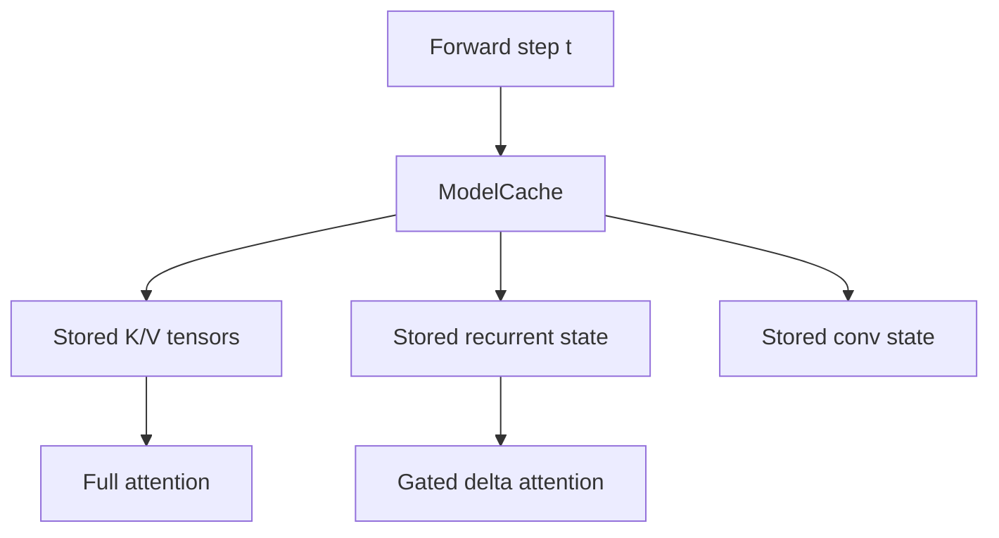

# `cache.py`

`cache.py` stores reusable sequence state for decoding.
It is the memory layer that lets the model append new tokens without recomputing everything from scratch.

## What it stores
`ModelCache` keeps four independent state banks:
- key tensors for full attention layers
- value tensors for full attention layers
- recurrent states for delta layers
- convolution states for delta layers

## Why this is a distinct module
Caching is state management, not model math.
Keeping it separate makes the forward pass cleaner and makes each state type easier to inspect.

## KV cache math
When a new segment arrives, the cache concatenates the previous keys and values along the time axis:

$$
K_{\text{new}} = [K_{\text{past}}; K_{\text{step}}], \quad
V_{\text{new}} = [V_{\text{past}}; V_{\text{step}}]
$$

That means a later attention step can attend to the whole prefix without rebuilding it.

## Recurrent-state intuition
For linear / recurrent attention, the cache acts like a persistent hidden memory:

$$
S_t = f(S_{t-1}, q_t, k_t, v_t)
$$

The exact update rule lives in the delta block, but the cache owns the storage.

## Diagram

## Design note
A list-of-states approach is simple and explicit.
If you later want more advanced caching, this module is the place to swap in a more structured cache object without touching the rest of the model.
