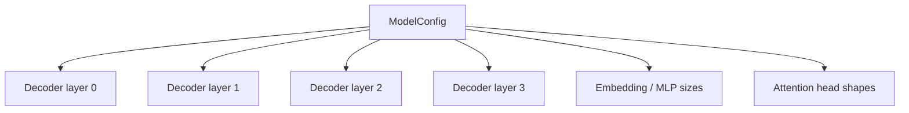

# `config.py`

`config.py` turns model hyperparameters into an immutable object. That matters because the rest of the architecture depends on a stable contract: attention heads, rotary dimensions, feed-forward size, and layer routing should not drift at runtime.

## What this module does
The `ModelConfig` dataclass holds every architectural choice in one place:
- vocabulary and special tokens
- hidden size and layer count
- attention head shapes
- MLP width
- rotary settings
- the layer routing list that decides which decoder layers are full attention and which are linear attention

## Why this design is better
A frozen dataclass is a good fit because the config is a specification, not state.
It gives you:
- explicit defaults
- type hints
- easy cloning or replacement
- a single source of truth for the full model

The key design choice is `layer_types`. That list is effectively a strategy map. Instead of hard-coding every block to behave the same way, the decoder reads the list and instantiates the right attention backend per layer.

## Reasoning
If the architecture parameters were spread across constructors, it would be easy for the head dimensions or layer schedule to become inconsistent. With a dataclass, the model can validate and compose everything from one definition.

## Diagram

## Math / shape contract
The config defines the dimensions used throughout the model:

$$
q \in \mathbb{R}^{B \times H_q \times T \times d_h}, \quad
k,v \in \mathbb{R}^{B \times H_{kv} \times T \times d_h}
$$

and for the MLP:

$$
\text{hidden} \to \text{intermediate} \to \text{hidden}
$$

If you change one number here, every module downstream inherits the new shape consistently.
