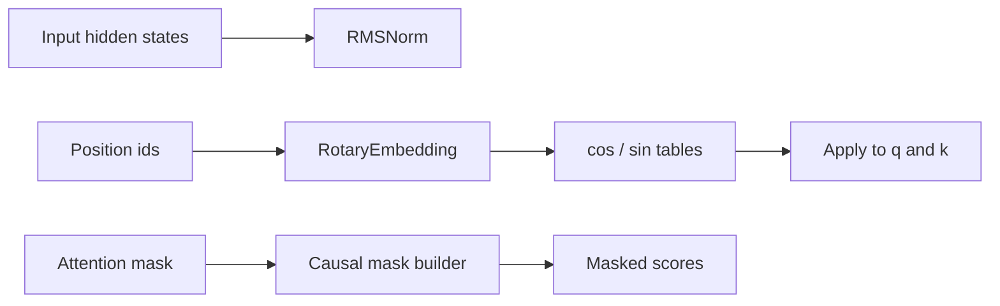

# `core.py`

`core.py` contains the mathematical primitives used by both attention paths.
It is the lowest-level module in the refactor, so everything else depends on it.

## Contents
- `RMSNorm`
- `RotaryEmbedding`
- `build_causal_mask`

## RMSNorm
RMSNorm rescales each token by the root mean square of its features:

$$
\operatorname{RMS}(x) = \sqrt{\frac{1}{d}\sum_{i=1}^{d} x_i^2 + \varepsilon}
$$

and the output is:

$$
\operatorname{RMSNorm}(x) = \frac{x}{\operatorname{RMS}(x)} \odot w
$$

where $w$ is a learned weight vector.

Why it is used:
- it is cheaper than full normalization layers
- it keeps magnitude stable
- it works well in transformer-style blocks

## Rotary embeddings
RoPE injects position by rotating pairs of hidden dimensions.
Instead of adding a position vector, it applies a sinusoidal phase shift.

For each position $p$ and frequency $\omega_i$:

$$
\theta_{p,i} = p \cdot \omega_i
$$

Then the embedding is converted to cosine and sine tables.
Those tables are applied to the query and key tensors before attention.

This is useful because the attention score becomes position-aware without needing a separate absolute position embedding table.

## Causal masking
The causal mask prevents each token from attending to future tokens.
For a query length $T_q$ and key/value length $T_{kv}$, the mask is upper-triangular above the allowed region.

Conceptually:
- valid positions remain unchanged
- invalid positions are filled with $-\infty$
- softmax turns those entries into probability zero

## Diagram

## Why this separation helps
Putting normalization, rotation, and masking here keeps the attention modules focused on attention math, not utility code.
That reduces duplication and makes each piece easier to test.
