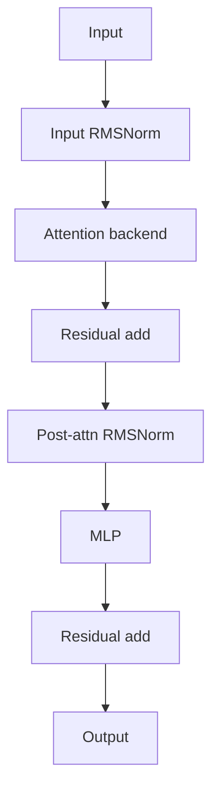

# `decoder.py`

`decoder.py` is the composition layer.
It combines normalization, one attention backend, a residual connection, a second normalization, and an MLP.

## Why this file matters
The decoder layer is where the model architecture becomes concrete.
It decides how information flows through a single transformer block.

## Pattern used
This file uses a small factory-style selection:
- `Linear_attention` selects `GatedDeltaNet`
- anything else selects `FullAttentionBlock`

That keeps the layer type decision in one place and prevents the model from duplicating branching logic.

## Forward pass
1. Normalize the input.
2. Run the chosen attention backend.
3. Add a residual connection.
4. Normalize again.
5. Apply the gated MLP.
6. Add the second residual connection.

Mathematically, if $x$ is the input and $A(\cdot)$ is the selected attention block:

$$
\tilde{x} = x + A(\operatorname{Norm}(x))
$$

$$
y = \tilde{x} + \operatorname{MLP}(\operatorname{Norm}(\tilde{x}))
$$

## Diagram

## Design reasoning
The decoder is intentionally thin.
Its job is not to implement attention math itself; its job is to orchestrate a block and preserve the model’s residual structure.
That makes the architecture easier to extend and test.
