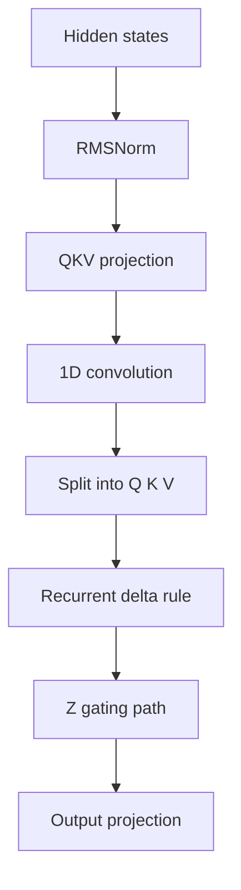

# `gated_delta.py`

`gated_delta.py` implements the linear-attention-style recurrent path.
It is the most stateful part of the model, so separating it into its own module makes the control flow much easier to reason about.

## Two layers of structure
This file contains two pieces:
- `RecurrentDeltaRule`, which performs the token-by-token state update
- `GatedDeltaNet`, which handles projections, convolution, gating, and output projection

That split is intentional:
- the rule is the math
- the module is the architecture

## Core update idea
At each time step, the recurrent state is updated by combining the value vector with a gated interaction between query and key:

$$
S_t = S_{t-1} + \beta_t \odot \big(V_t + \tanh(Q_t \odot K_t)\big)
$$

A separate gate controls how much of the state should be emitted:

$$
Y_t = \sigma(G_t) \odot S_t
$$

Then the block multiplies by the learned `z` path and projects back to the model width.

## Why the design is useful
The delta path is a recurrent alternative to full attention.
Instead of building a complete $T \times T$ score matrix, it updates a compact memory state step by step.
That can be useful when you want a sequential memory mechanism with lower quadratic pressure.

## Shape flow
- input: $[B, T, H]$
- projected stream: $[B, C, T]$
- split into $Q$, $K$, $V$
- heads reshaped to $[B, T, H_{heads}, d]$
- recurrent state: $[B, H_{heads}, d]$
- output: $[B, T, H]$

## Diagram

## Design reasoning
The recurrent update is intentionally encapsulated in its own helper class.
That gives you a clean seam for future work:
- replace the update rule
- add a fused kernel
- benchmark against the reference implementation
- keep the outer module API unchanged
