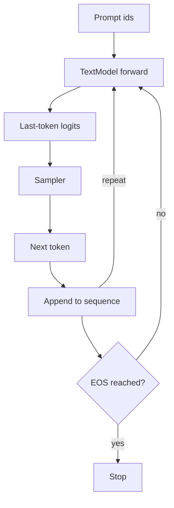

# `generation.py`

`generation.py` adds end-to-end token production on top of the refactored model.
It does not introduce a new neural block; instead, it turns the model’s logits into sampled token ids.

## Components
- `GenerationConfig` stores decoding settings.
- `TokenSampler` converts logits into one next-token choice.
- `TokenGenerator` runs the autoregressive loop.

## Why this belongs in its own module
Generation is an algorithmic layer on top of the model.
It is not part of the network weights, and it is not a decoder block.
Separating it keeps inference policy independent from model architecture.

## Sampling math
Given logits $z$ for the vocabulary, temperature rescales the distribution:

$$
\tilde{z} = \frac{z}{\tau}
$$

Then softmax produces probabilities:

$$
p_i = \frac{e^{\tilde{z}_i}}{\sum_j e^{\tilde{z}_j}}
$$

Top-k keeps only the largest $k$ logits.
Top-p keeps the smallest prefix of sorted tokens whose cumulative probability exceeds the threshold.

## Autoregressive loop
At step $t$, the generator:
1. feeds the current prefix into the model
2. reads the last-step logits
3. samples the next token
4. appends it to the sequence
5. repeats until the stop condition is met

Conceptually:

$$
\text{prefix}_{t+1} = [\text{prefix}_t; \hat{y}_t]
$$

## Diagram

## Reasoning
This module gives you practical text generation without cluttering the model code.
If you later add beam search, repetition penalty, or constrained decoding, those policies can live here.
