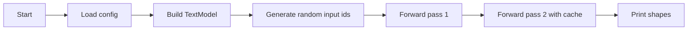

# `main.py`

`main.py` is the runnable demo for the refactored package.
It is intentionally tiny so you can verify the system quickly without needing a notebook or a training loop.

## What it demonstrates
The script runs two passes:
- a first pass over a fresh sequence
- a second pass using the cache from the first run

That proves the modular cache and model wiring work together.

## Why keep a separate entrypoint
A dedicated runner is useful because it gives you a reproducible smoke test.
You can change internals freely and still verify the same top-level behavior.

## Expected output
The demo prints:
- the first logits shape
- the cached sequence length
- the second logits shape
- the updated cache length

## Diagram

## Reasoning
This file is not a benchmark and not a training script.
It is the smallest possible proof that the refactored package is wired correctly.
