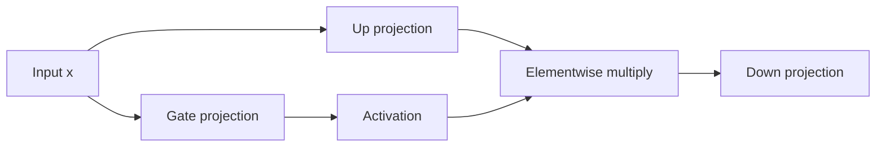

# `mlp.py`

`mlp.py` implements the gated feed-forward block, often called SwiGLU-style MLP.
It is the token-wise nonlinear transformation used after attention.

## What the block does
The input is projected into two parallel streams:
- one stream is passed through an activation function
- the other stream acts as a learned gate

The result is multiplied elementwise and projected back down:

$$
\operatorname{MLP}(x) = W_d\big(\phi(W_g x) \odot W_u x\big)
$$

where $\phi$ is the activation function.

## Why gated MLPs work well
Compared with a plain two-layer MLP, the gate gives the network a way to suppress or amplify features conditionally.
That often improves expressivity without changing the interface seen by the rest of the transformer block.

## Supported activations
The module keeps a small activation registry so the config can choose the nonlinear function by name.
That is a light version of the Strategy pattern:
- the model asks for an activation by key
- the module resolves the right callable
- the decoder stays agnostic to the exact choice

## Diagram

## Reasoning
This block is deliberately small because most of its value comes from composition, not control flow.
Keeping it isolated makes it easy to reuse, benchmark, or swap for a different feed-forward design later.
