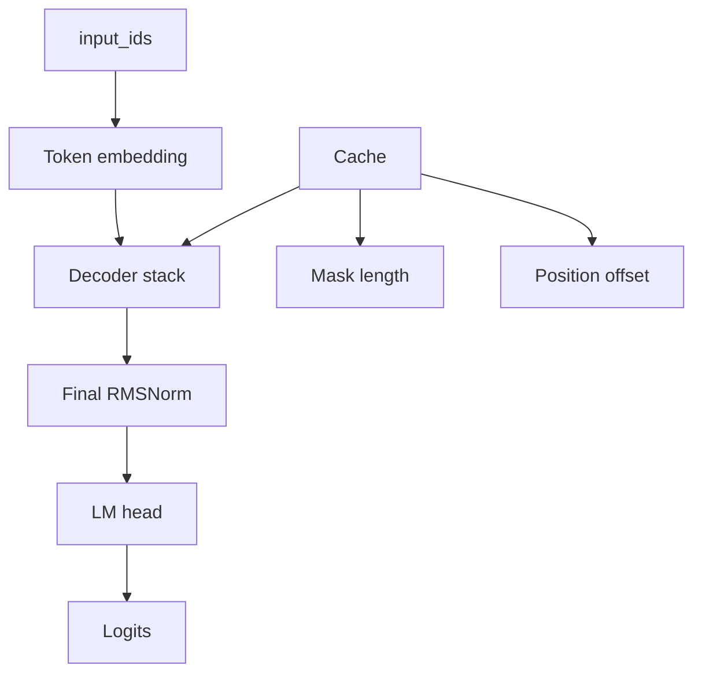

# `model.py`

`model.py` assembles the full text model.
It is the orchestration layer that connects token embeddings, decoder layers, final normalization, and the output head.

## Forward path
1. Convert input token ids into embeddings.
2. Create or reuse a cache.
3. Build the attention mask.
4. Compute position ids.
5. Pass the hidden states through each decoder layer.
6. Normalize the final hidden states.
7. Project to vocabulary logits.

## Why this module is separate
The full model should read like a control loop, not a math notebook.
By keeping attention, delta rules, and MLPs elsewhere, the model file stays focused on architecture-level flow.

## Shapes
- input ids: $[B, T]$
- embeddings: $[B, T, H]$
- logits: $[B, T, V]$

where:
- $B$ is batch size
- $T$ is sequence length
- $H$ is hidden size
- $V$ is vocabulary size

## Cache handling
The model asks the cache how many prefix tokens have already been seen.
That allows it to extend the mask and build the correct position ids for incremental decoding.

## Diagram

## Reasoning
This module is the best place to understand the model end to end.
If you want to add sampling, generation, or beam search later, this is the layer you build around.
