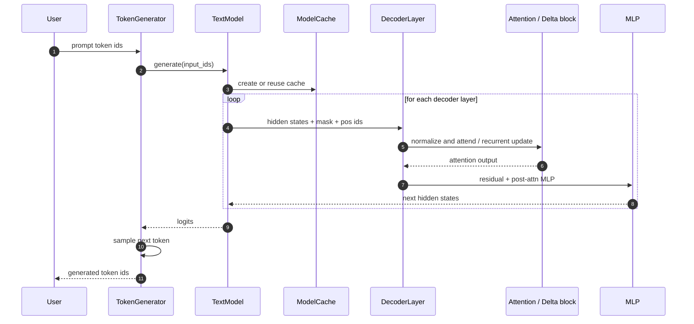
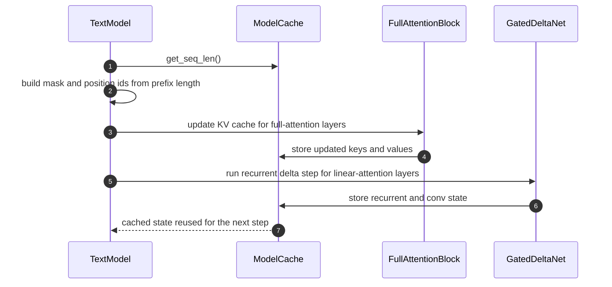

# Overview

This overview shows how the refactored package fits together from prompt to token generation.

## Forward pass sequence

## Cache flow sequence

## Cross-links
- [Configuration](config.md)
- [Core math](core.md)
- [Cache](cache.md)
- [Full attention](attention.md)
- [Gated delta block](gated_delta.md)
- [Feed-forward block](mlp.md)
- [Decoder composition](decoder.md)
- [Model orchestration](model.md)
- [Generation](generation.md)
- [Runnable demo](main.md)
